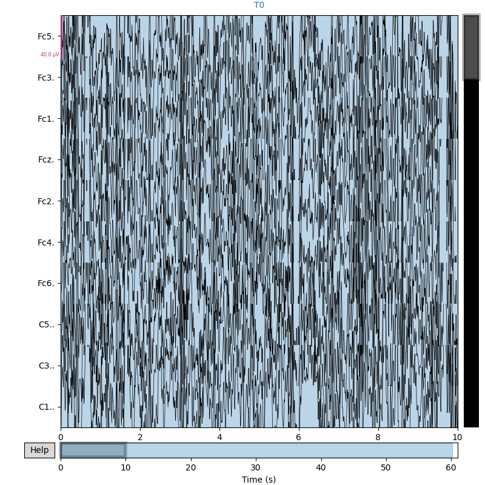

# EEG Analysis Tool
Analyzes EEG data from PhysioNet.

## Setup
- `pip3 install -r requirements.txt`
- Download data: `python3 download_eeg.py` (~1.5 GB)
- Run: `python3 eeg_analysis.py`

## Features
- Downloads dataset (~50 min at 500 KB/s)
- Loads EDF files
- Filters 1-40 Hz
- Plots raw and PSD

## Data
[PhysioNet EEG](https://physionet.org/content/eegmmidb/)

## Example Output

